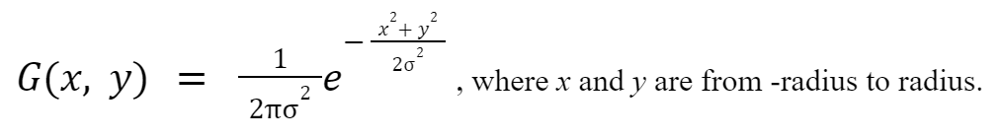
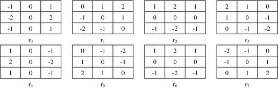
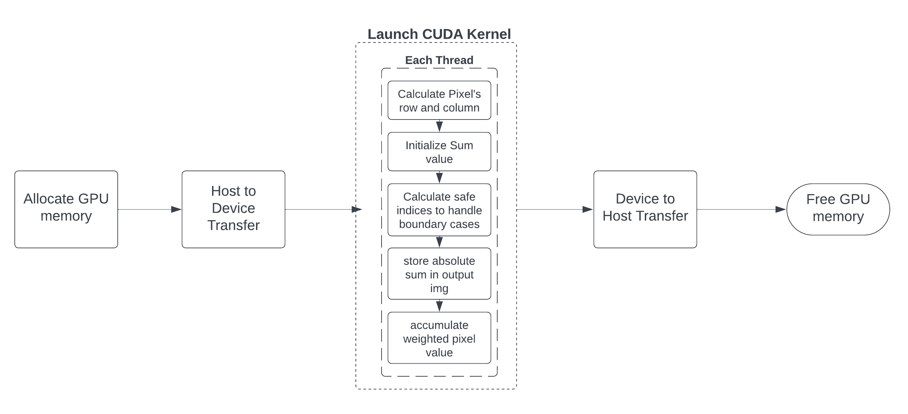

# Robinson's Compass Mask CUDA

CUDA implementation of Robinson's Compass Mask.

## Group 2

- ALONZO, Jose Anton
- AVELINO, Joris Gabriel
- CRUZ, Airon John
- HERNANDEZ, Pierre Vincent

## Important Links

- Video Demo [*[Click here](https://drive.google.com/file/d/1kbpBNNxL0eAHylQ_2PxoPdjoKityo-rE/view?usp=sharing)*]
- Google Colab (CUDA) [*[Click here](https://colab.research.google.com/drive/1gmKF_8sjE_Ch6-nqIH-22c-YjDAvIrzv?usp=sharing)*]
- Google Docs (Documentation) [*[Click here](https://docs.google.com/document/d/1Q6TS2BFv-TXl4uavYhmyUjAo4XYBiE9TKLGyP9K0bEo/edit?usp=sharing)*]

## Implementation

There are 2 important steps in edge detection, which is the smoothing and 
detection step. The smoothing step consists of a smoothing filter being 
applied to the image. As for the detection step, it consists of an edge 
detection filter or mask.

In this project, the Gaussian Blur (GB) will be used for the smoothing 
filter, and the Robinson’s Compass Mask (RCM) for edge detection. Gaussian 
Blur is done by convolving the Gaussian Blur kernel with the grayscale 
image. The smoothing kernel is initialized using the Gaussian function:



As for the Robinson’s Compass Mask, it was done using eight masks or kernels 
that each represented a compass direction: North, North-West, West, South-West, 
South, South-East, East and North-East.



Given that convolution of said masks or kernels doesn’t rely on previous outputs, 
it paved a way for parallelization.

### Parallel Algotrithms Implemented

The parallelization algorithm utilized to apply the Robinson Compass Mask to an image, 
as depicted in the program, exploits the inherent power of CUDA to achieve substantial 
computational efficiency. The algorithm utilizes a Single Instruction, Multiple Threads 
(SIMT) approach of CUDA architecture. Specifically, the input image is divided into a 
grid of thread blocks, with each block containing multiple threads. These threads 
operate in parallel, calculating the filtered value for their respective pixel positions. 
Employing the SIMT model within the algorithm, ensures that the same instructions are 
executed across threads within a warp, while the other threads are working on different 
data elements. Each deployed thread computes the convolution or the weighted sum of the 
products of the input image’s pixel values in its neighborhood with the predefined RCM, 
contributing to the speedup process of the overall edge detection subroutine. Thus, 
parallelization in this context is by distributing the workload among threads. Notably, 
each thread operates independently, which also minimizes the need for inter-thread 
communication and synchronization. This parallel approach aligns well with image 
processing tasks, as the same filter mask is applied across various regions of the 
image. For further enhancement, we have successfully incorporated a grid-stride loop 
into our parallel algorithm. This implementation guarantees that every pixel within 
the input image is processed, leaving no computation potential untapped. This 
refined approach not only accelerates processing but also enables us to extract the 
most value from our parallel processing framework.



The parallel algorithm’s memory management pattern, on the other hand,  involves (1) 
allocating GPU memory, (2) copying data between the CPU and GPU (host to device), (3) 
launching the CUDA kernel for RCM, and (4) copying the results back to the CPU (device 
to host). By capitalizing on SIMT, the algorithm achieves significant speedup compared 
to traditional sequential methods, without compromising the effectiveness of applying 
the RCM in edge detection. Specifically, device memory on the GPU is allocated for both 
input and output image using `cudaMalloc`. This dedicated memory space is vital for 
effective parallel processing on the GPU—ensuring that parallel threads can independently 
and simultaneously access and manipulate data without contention. Furthermore, data is 
transferred from the host to the GPU using `cudaMemcpy`, specifically for the input image 
and the RCM arrays. This step ensures that the essential data needed for computation is 
available in the GPU’s memory. Upon completion of the computation, the resulting image is 
transferred back to the host memory using cudaMemcpy but this time, using 
`cudaMemcpyDeviceToHost` direction. This memory management pattern supports and 
complements the parallel algorithm, handling the data movement, reducing unnecessary 
overhead, and optimizing memory usage— significantly contributing to the overall 
efficiency of parallel execution.

## Execution time comparison between sequential and parallel

**Table 1.** *Gaussian Blur Smoothing Execution Time (k = 9, σ = 1.0)*

|                               | Execution Time, us                       || Speedup |
| :---: | :---: | :---: | :---: |
| Image Size                    | Sequential (C)     | Parallel (CUDA)      ||
| 224 x 225 (cat_small.jpg)     | 56000.00 (56 ms)   | 530.93 (0.5309 ms)   | 105.48 |
| 879 x 879 (house_drawing.jpg) | 405000.00 (405 ms) | 6275.70 (6.2757 ms)  | 64.53  |
| 1244 x 1669 (cat_big.jpg)     | 939000.00 (939 ms) | 16651.00 (16.651 ms) | 56.39  |
| 2000 x 1500 (circuit_2.jpg)   | 3300000.00 (3.3 s) | 23825.00 (23.825 ms) | 138.51 |
| 1000 x 665 (circuit.png)      | 348000.00 (348 ms) | 5410.70 (5.4107 ms)  | 64.32  |

<br />

**Table 2.** *Average Robinson’s Compass Mask Edge Detection Sequential Execution Time for a Single Direction*

|                               | Average Execution Time, us                || Speedup |
| :---: | :---: | :---: | :---: |
| Image Size                    | Sequential (C)        | Parallel (CUDA)    ||
| 224 x 225 (cat_small.jpg)     | 4750.00 (4.75 ms)     | 10.475 (0.0105 ms) | 452.38  |
| 879 x 879 (house_drawing.jpg) | 32375.00 (32.375 ms)  | 72.598 (0.7260 ms) | 44.59   |
| 1244 x 1669 (cat_big.jpg)     | 106250.00 (106.25 ms) | 181.80 (0.1818 ms) | 584.43  |
| 2000 x 1500 (circuit_2.jpg)   | 187500.00 (187.50 ms) | 265.17 (0.2652 ms) | 707.01  |
| 1000 x 665 (circuit.png)      | 59750.00 (59.75 ms)   | 63.466 (0.0635 ms) | 940.94  |

<br />

**Table 3.1** *Total Robinson’s Compass Mask Edge Detection Execution Time without Smoothing*

|                               | Total Execution Time, us                || Speedup |
| :---: | :---: | :---: | :---: |
| Image Size                    | Sequential (C)     | Parallel (CUDA)     ||
| 224 x 225 (cat_small.jpg)     | 38000.00 (38 ms)   | 83.8 (0.0838 ms)    | 453.46  |
| 879 x 879 (house_drawing.jpg) | 259000.00 (259 ms) | 580.784 (0.5808 ms) | 445.94  |
| 1244 x 1669 (cat_big.jpg)     | 850000.00 (850 ms) | 1454.40 (1.4544 ms) | 584.43  |
| 2000 x 1500 (circuit_2.jpg)   | 1500000.00 (1.5 s) | 2121.36 (2.1214 ms) | 707.08  |
| 1000 x 665 (circuit.png)      | 478000.00 (478 ms) | 507.728 (0.5077 ms) | 941.50  |

<br />

**Table 3.2** *Total Robinson’s Compass Mask Edge Detection Execution Time with Smoothing (k = 9, σ = 1.0)*

|                               | Total Execution Time, us                    || Speedup |
| :---: | :---: | :---: | :---: |
| Image Size                    | Sequential (C)       | Parallel (CUDA)       ||
| 224 x 225 (cat_small.jpg)     | 94000.00 (94 ms)     | 614.73 (0.6147 ms)    | 152.92  |
| 879 x 879 (house_drawing.jpg) | 664000.00 (664 ms)   | 6856.484 (6.8565 ms)  | 96.84   |
| 1244 x 1669 (cat_big.jpg)     | 1789000.00 (1.789 s) | 18105.40 (18.1054 ms) | 98.81   |
| 2000 x 1500 (circuit_2.jpg)   | 4800000.00 (4.8 s)   | 25946.36 (25.9464 ms) | 185     |
| 1000 x 665 (circuit.png)      | 826000.00 (826 ms)   | 5918.428 (5.9184 ms)  | 139.56  |


## Result Analysis and Discussion

Given the variety of sample input images utilized for the execution of the program, it 
can be deduced that the dimensions of the image has a significant impact on the 
performance of the several steps of the edge detection process.

With regard to the smoothing filter phase, the values of the certain parameters affect 
the time taken to generate the Gaussian blur mask alongside the image size. While the 
sigma value has no bearing on the performance since it merely dictates the intensity 
of the Gaussian blur, the mask or kernel size is indeed dependable by the execution 
time. A higher mask size entails a longer runtime due to the number of calculations 
necessary for the Gaussian blur generation itself. Subsequently, the application of the 
Gaussian blur mask onto the image also affects the execution time of the process, 
depending on the size of the image as well. The total time it takes to generate and 
apply the Gaussian blur mask onto the variety of input images is recorded in Table 1.

In terms of the edge detection phase of the process using the Robinson’s Compass Mask 
filter, it is important to note that the average execution time as exhibited in Table 2 
is obtained by measuring the execution time for each of the eight filter directions 
(i.e. N, S, E, W, NE, NW, SE, SW) and getting their mean value. For the sake of discussion, 
it is assumed that this computed value is the time it takes to perform the convolution on 
the input image using each directional filter. The outcome of applying each Robinson’s 
Compass Mask filter on the different sample inputs can be visualized from Figures 1 to 5.

With the current CUDA implementation as explained earlier, it is verified that page faults 
and other complications were avoided during runtime. Comparing the tables for the 
respective measurements between the sequential and the parallelized algorithms, one can 
see a drastic improvement in terms of the execution speed. By inspecting the speedup by 
dividing the initial time by the improved time in Tables 3.1 and 3.2, the extremely large 
values indicate that parallelization with CUDA indeed lowers execution time for the 
preprocessing aspect of the program as well as the actual application of the Robinson’s 
Compass Mask filter.

## Adding image input

Place the images under the **`/inputs`** directory.

## Output images

Output images can be seen under the **`/outputs`** directory.

## Compiling C

```
# Windows
gcc -std=c11 -Wall rcm_c.c -o rcm_c.exe

# Linux/MacOS
gcc -std=c11 -Wall rcm_c.c -o rcm_c.out
```

## Running C program

```
# Windows
rcm_c

# Linux/MacOS
./rcm_c.out
```

## Running CUDA version

Link to Google Colab: [RCM_cuda.ipynb](https://colab.research.google.com/drive/1gmKF_8sjE_Ch6-nqIH-22c-YjDAvIrzv?usp=sharing)

1. Set the `Runtime Type` to use GPU.
2. Create the corresponding folders in the file explorer of Google Colab runtime:
    - `grayscale`
    - `inputs`
    - `outputs`
3. Upload the header files:
    - `stb_image.h`
    - `stb_image_write.h`
4. Upload input images under the `inputs` folder.

## Entering filename for image input

The program will prompt for filename input as seen below:

```
Enter the image filename: |
```

Just enter the filename of the image itself without prefixing the `./inputs/` directory.

Sample directory:

```
images
    | - sample.jpg
```

In the program:

```
Enter the image filename: sample.jpg
```
